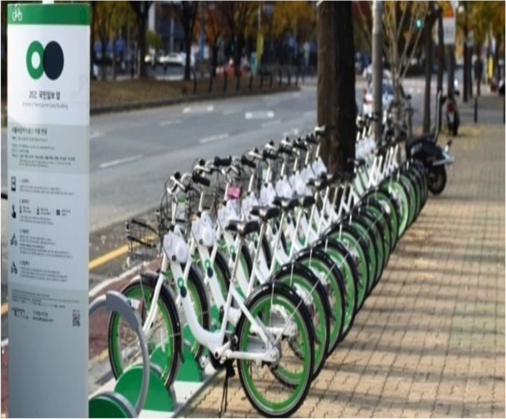

# bike_sharing

Data Set Information:
free public data set from https://archive.ics.uci.edu/ml/datasets/Seoul+Bike+Sharing+Demand

The porject consist on predicting the number of bikes rented per hour in Seoul city!:

Figure reproduced from https://doi.org/10.1049/iet-its.2019.0796

Currently Rental bikes are introduced in many urban cities for the enhancement of mobility comfort. 
It is important to make the rental bike available and accessible to the public at the right time as it lessens the waiting time. 
Eventually, providing the city with a stable supply of rental bikes becomes a major concern.
The crucial part is the prediction of bike count required at each hour for the stable supply of rental bikes.
The dataset contains weather information:

(Temperature, Humidity, Windspeed, Visibility, Dewpoint, Solar radiation, Snowfall, Rainfall), the number of bikes rented per hour and date information.
